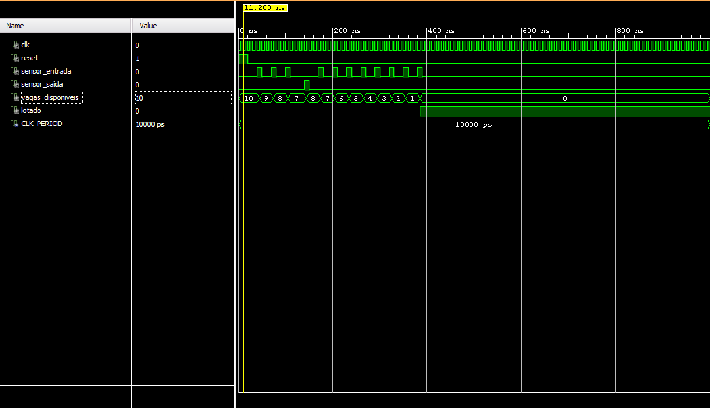

# Sistema de Controle de Estacionamento

**Integrantes:** Thiago Marzari & Yuri Alexander

---

## 📋 Objetivo do Circuito

O projeto consiste em um sistema digital de controle de estacionamento implementado em VHDL. O circuito tem como objetivo gerenciar automaticamente a ocupação de um estacionamento, utilizando sensores de entrada e saída para monitorar o fluxo de veículos. O sistema exibe um sinal de "**LOTADO**" quando a capacidade máxima é atingida, impedindo novas entradas até que haja vagas disponíveis.

---

## 🔄 Diagrama de Estados e Descrição da FSM

O sistema não utiliza uma máquina de estados finitos (FSM) explícita com múltiplos estados, mas sim um **contador síncrono** que gerencia as vagas disponíveis. O funcionamento pode ser descrito como:

### Lógica de Operação:

```
┌─────────────────────────────────────────────┐
│          Estado: RESET (vagas = 10)         │
└──────────────────┬──────────────────────────┘
                   │
                   ▼
┌─────────────────────────────────────────────┐
│       Monitoramento Contínuo (Clock)        │
│                                             │
│  • sensor_entrada = '1' AND vagas > 0       │
│    → vagas = vagas - 1                      │
│                                             │
│  • sensor_saida = '1' AND vagas < 10        │
│    → vagas = vagas + 1                      │
│                                             │
│  • vagas = 0  → lotado = '1'                │
│  • vagas > 0  → lotado = '0'                │
└─────────────────────────────────────────────┘
```

### Sinais de Entrada e Saída:

| Sinal               | Tipo    | Descrição                                      |
| ------------------- | ------- | ---------------------------------------------- |
| `clk`               | Entrada | Sinal de clock para sincronização              |
| `reset`             | Entrada | Reinicia o sistema com 10 vagas disponíveis    |
| `sensor_entrada`    | Entrada | Detecta entrada de veículo (ativo em '1')      |
| `sensor_saida`      | Entrada | Detecta saída de veículo (ativo em '1')        |
| `vagas_disponiveis` | Saída   | Contador de 0 até n_max indicando vagas livres |
| `lotado`            | Saída   | Sinal '1' quando não há vagas disponíveis      |

---

## ⚙️ Funcionamento Passo a Passo

### 1. **Inicialização**

Ao iniciar o sistema ou quando o sinal `reset` é ativado, o estacionamento é configurado com **10 vagas disponíveis** e o sinal `lotado` é desativado ('0').

### 2. **Entrada de Veículos**

- Quando o `sensor_entrada` detecta um veículo (sinal em '1') na borda de subida do clock:
  - O sistema verifica se há vagas disponíveis (`vagas > 0`)
  - Se houver vaga, o contador de vagas é **decrementado** em 1
  - O veículo é permitido entrar no estacionamento

### 3. **Saída de Veículos**

- Quando o `sensor_saida` detecta um veículo saindo (sinal em '1'):
  - O sistema verifica se o estacionamento não está completamente vazio (`vagas < 10`)
  - Se válido, o contador de vagas é **incrementado** em 1
  - Uma nova vaga fica disponível

### 4. **Indicação de Lotação**

- O sinal `lotado` é continuamente atualizado:
  - `lotado = '1'` quando `vagas_disponiveis = 0`
  - `lotado = '0'` quando há pelo menos uma vaga disponível

### 5. **Proteções do Sistema**

- **Não permite entrada** quando o estacionamento está lotado (`vagas = 0`)
- **Não incrementa o contador** acima de 10 vagas (capacidade máxima)
- Opera de forma **síncrona** com o clock para evitar condições de corrida

---

## 🖼️ Simulação do Sistema



### Cenários Testados:

**Teste 1 - Reset Inicial:**

- Sistema inicia com 10 vagas disponíveis
- Sinal `lotado` permanece em '0'

**Teste 2 - Entrada de Veículos:**

- 3 carros entram sequencialmente
- Contador reduz de 10 → 9 → 8 → 7 vagas

**Teste 3 - Saída de Veículo:**

- 1 carro sai do estacionamento
- Contador aumenta de 7 → 8 vagas

**Teste 4 - Estacionamento Lotando:**

- 7 carros adicionais entram
- Vagas reduzem de 8 → 1 → 0
- Sinal `lotado` ativa quando atinge 0 vagas

**Teste 5 - Tentativa de Entrada com Lotação:**

- Sensor de entrada é ativado, mas o contador permanece em 0
- Sistema impede entrada quando lotado

---

**Projeto desenvolvido para a disciplina de Sistemas Digitais**
